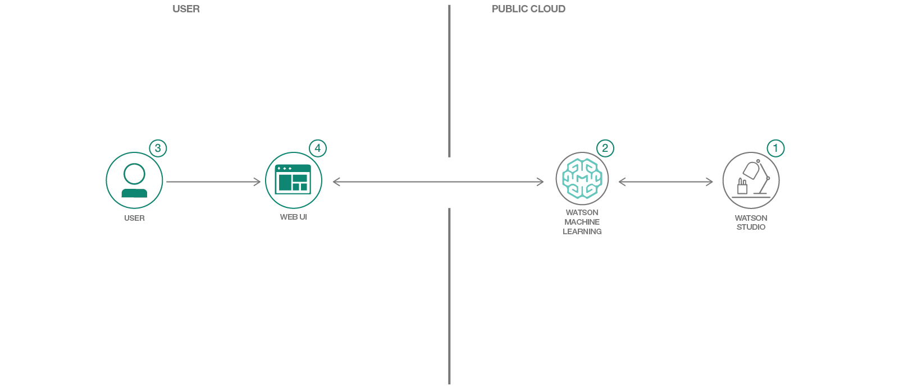
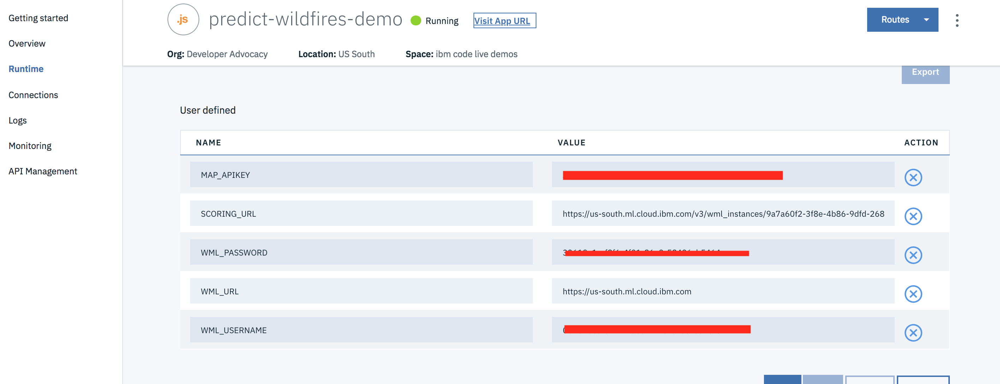

# Predict Wildfire Intensity with Watson Studio Machine Learning

For this Code Pattern, we will use [data on Wildfires](https://firms.modaps.eosdis.nasa.gov/active_fire/#firms-txt) from [NASA](https://earthdata.nasa.gov/) to predict the intensity of Wildfires, using [Watson Studio](https://cloud.ibm.com/catalog/services/watson-studio) [Machine Learning](https://cloud.ibm.com/catalog/services/machine-learning).
NASA provides data for various things, from weather and climate to solar flares and wildfire. This data is paid for by U.S. taxpayers and is free to use. The missing component is machine learning, which can take data and train a model to predict one of the features of the data set. For this example, we'll grab wildfire data and build a model that can predict intensity of the fire base on latitude and longitude.

When the reader has completed this Code Pattern, they will understand how to:

* Use [Watson Studio](https://cloud.ibm.com/catalog/services/watson-studio) [Machine Learning](https://cloud.ibm.com/catalog/services/machine-learning) to train a model.
* Gather data from NASA for Wildfires.
* Create a predictor for intensity of wildfires based on latitude and longitude.
* Create a Node.js server that can utilize the Watson Machine Learning service for predicting wildfire intensity.



## Flow

1. Use Watson Studio to add data assets and services.
2. Create the Machine Learning Model in Watson Machine Learning.
3. User interacts with Web UI to choose location of a fire.
4. Web UI interacts with ML model to predict brightness of fire.

## Included components

* [Watson Studio](https://cloud.ibm.com/catalog/services/watson-studio)
* [Machine Learning](https://cloud.ibm.com/catalog/services/machine-learning)

## Featured technologies

* [Artificial Intelligence](https://medium.com/ibm-data-science-experience): Artificial intelligence can be applied to disparate solution spaces to deliver disruptive technologies.
* [Node.js](https://nodejs.org/): An asynchronous event driven JavaScript runtime, designed to build scalable applications.

<!--
# Watch the Video
-->

# Prerequisites

* Install [Node.js and npm](https://nodejs.org/en/download/) (`npm` version 4.5.0 or higher)
* For this pattern you will need to download [current wildfire data](https://firms.modaps.eosdis.nasa.gov/active_fire/#firms-txt) in CSV format. Please choose `7d` for 7 days worth of information.
* You may additionally download [archived data](https://firms.modaps.eosdis.nasa.gov/download/) which will take time due to the request process.
* You will need a [Maps API key](https://developers.google.com/maps/documentation/javascript/get-api-key).

# Steps

1. [Clone the repo](#1-clone-the-repo)
1. [Create Watson Studio services with IBM Cloud](#2-create-watson-studio-services-with-ibm-cloud)
1. [Get the credentials](#3-get-the-credentials)
1. Either Deploy to IBM Cloud or Deploy locally

    3a. [Deploy to IBM Cloud](#3a-deploy-to-ibm-cloud)

    3b. [Deploy locally](#3b-deploy-locally)

### 1. Clone the repo

Clone the `predict-wildfires` repository locally. In a terminal, run:

```
$ git clone https://github.com/IBM/predict-wildfires
```

### 2. Create Watson Studio services with IBM Cloud

* On [Watson Studio](https://dataplatform.cloud.ibm.com/) choose `New project`:


and pick `Data Science`:


* Name the project and select your object storage:


* Choose `+ Add to project` -> `Data asset` or click the `10/01` button and add the data you downloaded in [Prerequisites](#prerequisites) (MODIS_C6_*_7d.csv):


* Under the `Settings` tab -> `Associated Services` choose `+ Add service` -> `Watson` and select `Machine Learning`. Either choose an `Existing` ML Service or create a `New` one.

* Under the `Settings` tab -> `Associated Services` choose `+ Add service` -> `Spark`. Either choose an `Existing` Spark Service or create a `New` one.

* Under the `Assets` tab -> `Models` choose `+ New Watson Machine Learning model`. Pick a name, the default `Select model type` of `Model builder`, and `Automatic` for "Prepare my data...".

* For `Select Data` choose the `MODIS_6_\*_7d.csv` file you added. When finished click `Next`.

* For `Select a Technique` -> `Column value to predict (Label Col)` choose `brightness`. This represents the intensity of the fire as measured by the brightness detected from a satellite.

* For `Feature columns` choose the features: `latitude` and `longitude`.

* For a Technique choose `Linear Regression` and Click `Next`.

* The model will train, and then `Save` the model.

* If you have downloaded archived data, you may create another model using that data using the same process.

* Once you've created the model, go to `Deployments` and click `+add Deployment`. Name it, keep the default `Web service`, and click `Save`. Leave this page open for the next step...

### Get the credentials

* If you haven't left it open from the previous step, from the [Watson Studio](https://dataplatform.cloud.ibm.com/home?context=analytics) project page, under the `Assets` tab, double click the `Watson Machine Learning` model you created earlier. Go to the `Deployments` tab and double click to open it.

* Go to the `Implementation` tab and copy the Scoring End-point at the top. You will use this as `SCORING_URL` in either the IBM Cloud Runtime Environment Variable or the locally deployed `.env` file.

* On your [Watson Studio](https://dataplatform.cloud.ibm.com/home?context=analytics) project page, got to the `Services` tab on the top menu bar, and navigate to the Watson Machine Learning service you created earlier. Double-click the service, go to `Service Credentials` -> `View Credentials`.


* You will need your [Maps API key](https://developers.google.com/maps/documentation/javascript/get-api-key).

* You will use the `username`, `password`, `url`, and `maps API key` in either the Runtime Environment variables when [running on IBM Cloud](#deploy-to-ibm-cloud) or in the `server/.env` file when [running locally](#run-locally). These will be `WML_URL`, `WML_USERNAME`, `WML_PASSWORD`, and `MAP_APIKEY`.

### 3.a Deploy to IBM Cloud

[](https://cloud.ibm.com/devops/setup/deploy?repository=https://github.com/IBM/predict-wildfires)

* Press the above ``Deploy to IBM Cloud`` button, under `IBM Cloud API Key:` choose `Create+`, and then click on ``Deploy``.

To monitor the deployment, in `Toolchains` click on `Delivery Pipeline`  and view the logs while the apps is being deployed.

* Once the app has deployed, click on `Runtime` on the menu and navigate to the `Environment variables` tab.



* Update the 5 environment variables with the `SCORING_URL`, `WML_URL`, `WML_USERNAME`, `WML_PASSWORD`, and `MAP_APIKEY` that you saved during [Get the credentials](#get-the-credentials).
The app will automatically restart and be ready for use.

### 3.b Deploy locally

* In the `server/` directory, move the `env.sample` file to `.env`.

* Populate the file with the `SCORING_URL`, `WML_URL`, `WML_USERNAME`, `WML_PASSWORD`, and `MAP_APIKEY` that you saved during [Get the credentials](#get-the-credentials).

```
SCORING_URL=""
WML_URL=""
WML_USERNAME=""
WML_PASSWORD=""
MAP_APIKEY=""
```

* Install the nodejs modules with `npm install`.

* Start the app with `npm start`. The app will now be running and available on you machine in a browser at `http://localhost:3000`.

# Sample Output


# Links

* [IBM Call for Code](https://developer.ibm.com/callforcode/)Answer the Call for Code by building global solutions for disaster preparedness.
* [NASA FIRMS (Fire Information for Resource Management)](https://firms.modaps.eosdis.nasa.gov/map/#z:3;c:-37.5,12.1;l:24hrs)Fires in the last 24 hours.
* [Can Scientists Predict a Wildfire's Spread?](https://www2.ucar.edu/atmosnews/perspective/2990/can-scientists-predict-wildfire-s-spread)
* [Predict a Wildfire's Behavior in Real Time](https://www.scientificamerican.com/article/finally-a-way-to-predict-a-wildfires-behavior-in-real-time/)
* [Watson Node.js SDK](https://github.com/watson-developer-cloud/node-sdk)

# Learn more

* **Artificial Intelligence Code Patterns**: Enjoyed this Code Pattern? Check out our other [AI Code Patterns](https://developer.ibm.com/code/technologies/artificial-intelligence/).
* **Data Analytics Code Patterns**: Enjoyed this Code Pattern? Check out our other [Data Analytics Code Patterns](https://developer.ibm.com/code/technologies/data-science/)
* **AI and Data Code Pattern Playlist**: Bookmark our [playlist](https://www.youtube.com/playlist?list=PLzUbsvIyrNfknNewObx5N7uGZ5FKH0Fde) with all of our Code Pattern videos
* **With Watson**: Want to take your Watson app to the next level? Looking to utilize Watson Brand assets? [Join the With Watson program](https://www.ibm.com/watson/with-watson/) to leverage exclusive brand, marketing, and tech resources to amplify and accelerate your Watson embedded commercial solution.
* **Data Science Experience**: Master the art of data science with IBM's [Data Science Experience](https://datascience.ibm.com/)
* **Spark on IBM Cloud**: Need a Spark cluster? Create up to 30 Spark executors on IBM Cloud with our [Spark service](https://cloud.ibm.com/catalog/services/apache-spark)

# License
This code pattern is licensed under the Apache Software License, Version 2.  Separate third party code objects invoked within this code pattern are licensed by their respective providers pursuant to their own separate licenses. Contributions are subject to the [Developer Certificate of Origin, Version 1.1 (DCO)](https://developercertificate.org/) and the [Apache Software License, Version 2](http://www.apache.org/licenses/LICENSE-2.0.txt).

[Apache Software License (ASL) FAQ](http://www.apache.org/foundation/license-faq.html#WhatDoesItMEAN)
